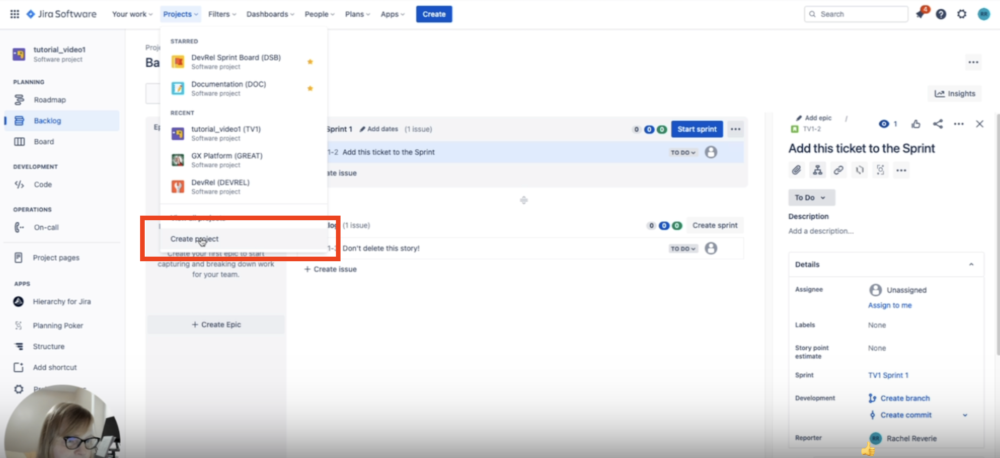
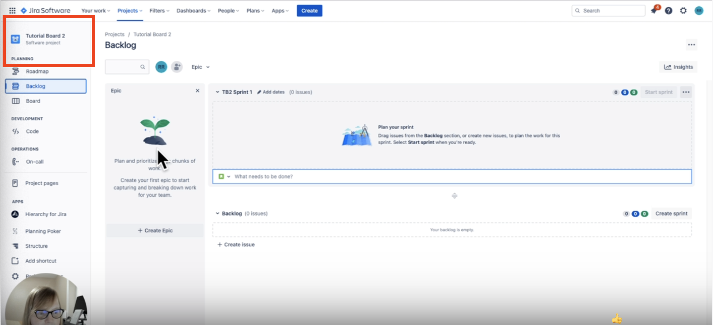
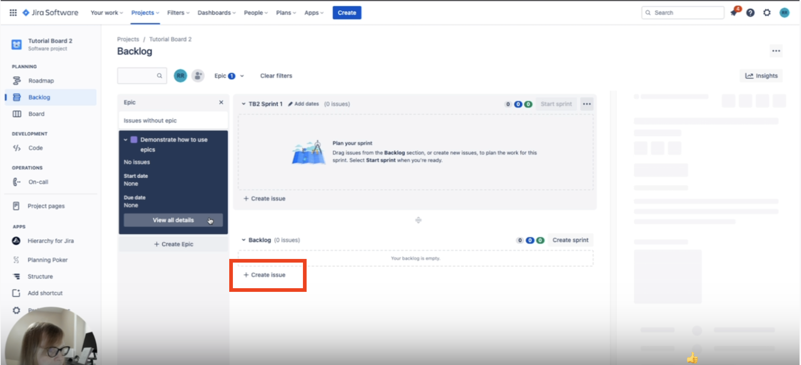
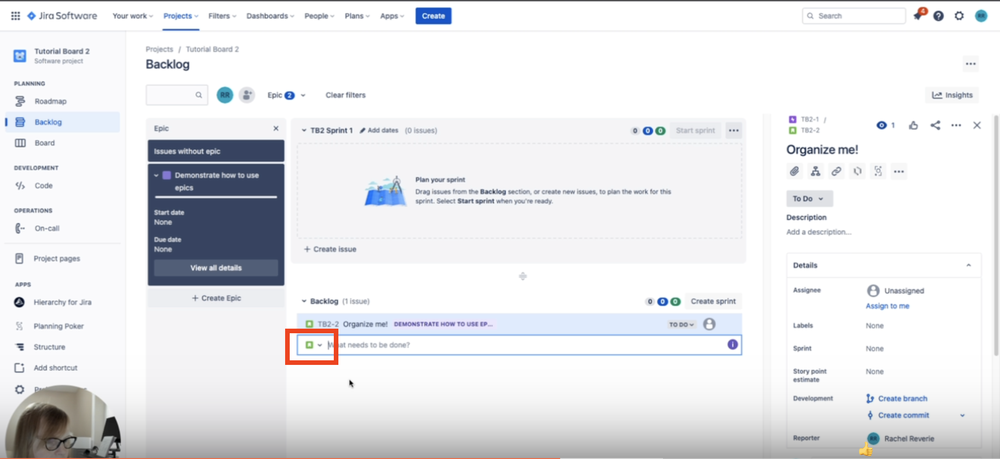
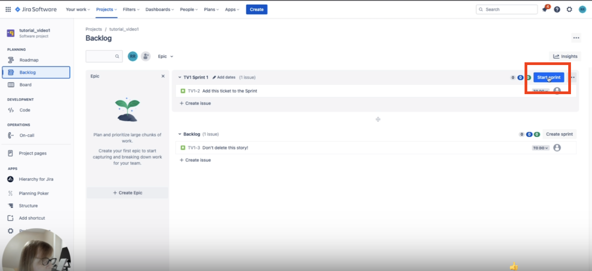

# How to launch Jira sprints

This guide explains how to create, populate, and start a sprint in Jira.

---

## Creating a sprint project

1. From the Jira landing page, select the `Project` menu from the top menu bar.

2. In the Project menu, select `Create project` as shown here:

   

4. Select a template from the options on the left menu. *Most sprints at Great Expectations use the **Software Development** template*.
5. Select the `Scrum` project type.
6. At the bottom of the page, select `Use template`.
7. Select either the `Team-managed` or `Company-managed` board.
   - **Team-managed boards** give more autonomy to individual teams.
   - **Company-managed boards** prioritize centralized control and uniformity across projects.  
   For more details, see the [Jira documentation](https://support.atlassian.com/jira-software-cloud/docs/learn-the-basics-of-team-managed-projects/).
8. Enter a name for the project in the `Name` field.
9. Select an access level. *Most projects at Great Expectations use **Limited access***.
10. Select `Create project`. Your new project now appears in the project menu in Jira.

---

## Populating a sprint

Now that you have created a sprint project, you can populate it with issues such as epics, stories, or tasks.

### Creating issues

Before populating your sprint, you need to create issues for any work tasks relevant to that sprint:

1. Ensure your Jira dashboard is in the project where you want to create issues. The selected project is shown in the top left of the dashboard:

   

2. From the left menu bar, select `Backlog`.
3. From the Backlog dashboard, select `Create issue`.

   

4. Select the issue type you want to create by selecting the issue icon as shown here:  

    
   
   Jira issue types include:
   - **Story**
   - **Epic**
   - **Task**
   - **Bug**  
   For more details on issue types, see the [Jira Documentation](https://www.atlassian.com/software/jira/guides/issues/overview#what-is-an-issue).

5. Write a brief description detailing what you want to accomplish in the issue. 
   
6. Repeat steps 3 through 5 to create as many issues as needed.

### Migrating issues

If you have issues not assigned to your project, you can transfer them to your project:

1. Open the Jira issue you want to move to a new project.
2. Click on the `More` option within the issue window.
3. From the `More` dropdown menu, select `Move`.
4. In the `Move issue` wizard, choose the project that you want to move the issue to.
5. Confirm the move.

---

## Starting a sprint

Now that you have a sprint populated with issues, you can launch the sprint to get it started:

1. From the left menu bar, select `Backlog`.
2. In the Backlog dashboard, select `Start sprint`. This opens a new window:

   

3. Edit the sprint details as necessary. Be sure to specify:
   - A clear goal for the sprint.
   - A time estimate for completion.
4. Select `Start` in the Start Sprint window.
